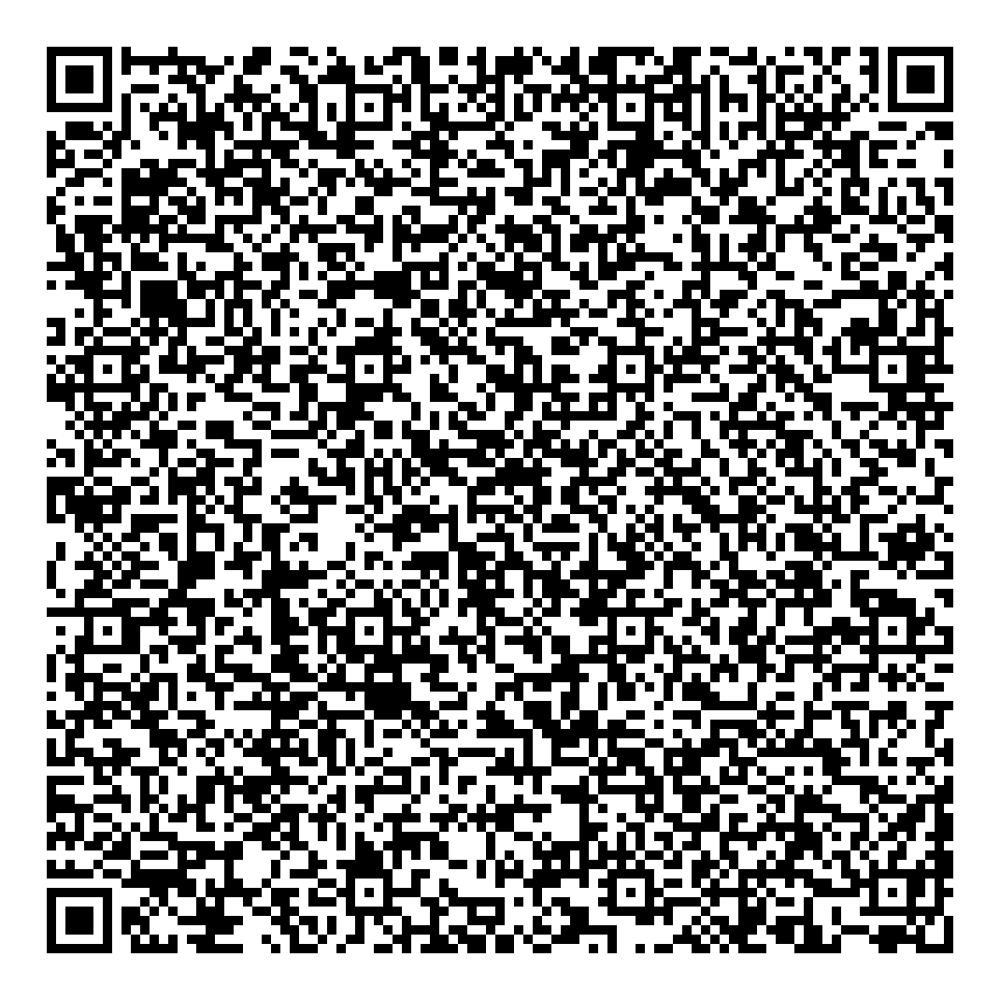

**QR Code Generator 📱️**
=====================================

**Generate QR codes with style 💫**

Welcome to the most epic QR code generator program ever created! 🎉 This Python program lets you create QR codes with custom colors, backgrounds, and more! 🎨

**How to use**
---------------

1. Download or clone this repository to your local machine. 💻
2. Open a terminal or command prompt and navigate to the directory where you saved the program. 📁
3. Run the program using Python: `python qr_code_generator.py` 🐍
4. Follow the prompts to enter your data, code color, background color, and file name. 📝
5. See your QR code generated in an image file! 📸

**Features**
------------

* Generate QR codes with custom data (e.g., text, URLs, phone numbers)
* Choose your code color and background color 🎨
* Save your QR code as an image file (e.g., PNG, JPG)

**Example Output**
-----------------

Here's an example of a generated QR code:

**Contributing**
--------------

Want to make this program even more awesome? 🤔 Contributions are welcome! Fork this repository, make your changes, and submit a pull request. We'd love to see your ideas! 🤝

**License**
---------

This program is licensed under the MIT License. See [LICENSE](LICENSE) for details.

**Author**
--------
Mehmed 👋

**Special Thanks**
-----------------

Thanks to the qrcode and Pillow libraries for making this program possible! 🙏

**Happy Coding!** 🎉
